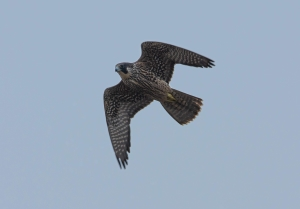
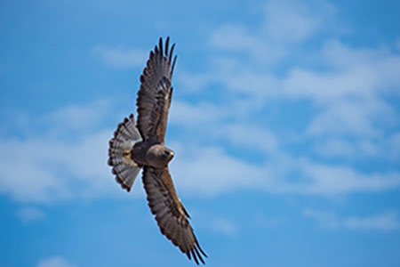
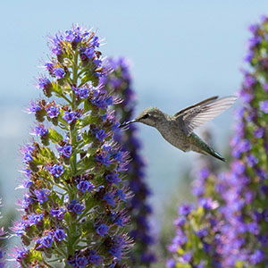
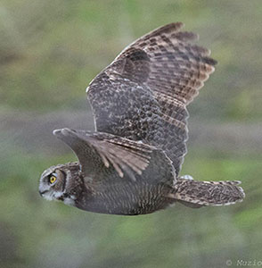
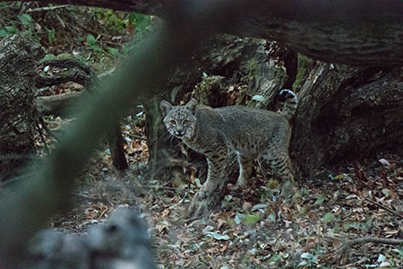

 
##  I am a PhD student in the UConn EEB department interested in the functional morphology of birds and mammals. I am currently a member of Margaret Rubega's lab and we are looking into feather morphology.
[My CV](PDFs/cv.pdf) 
[Contact Info](contact-info.html) 
 
 
 
 

